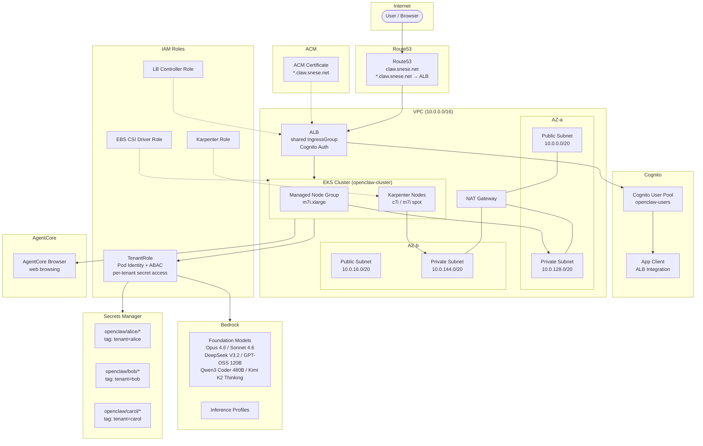
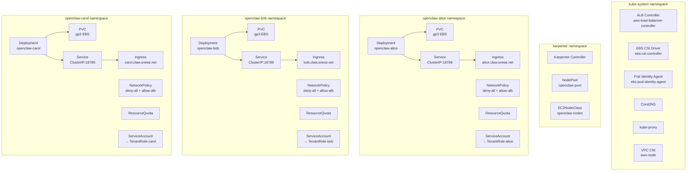
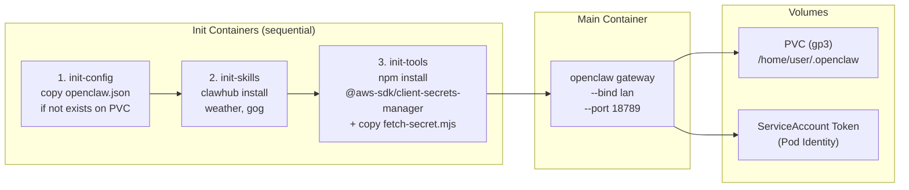
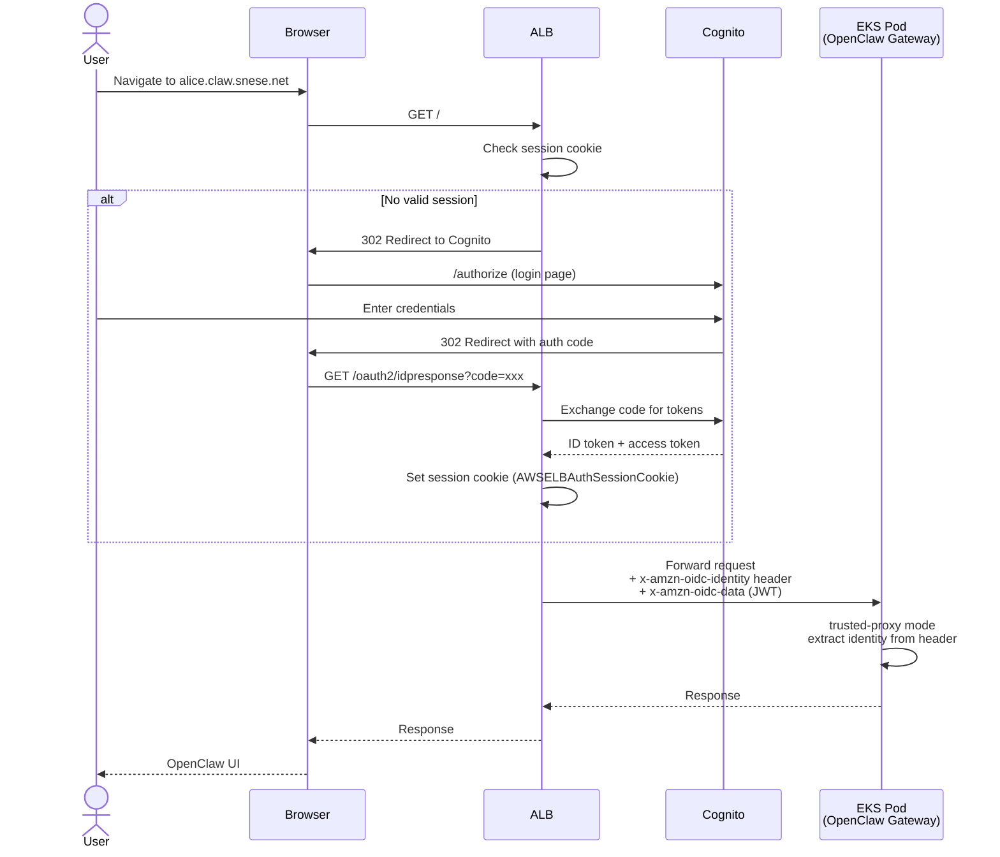
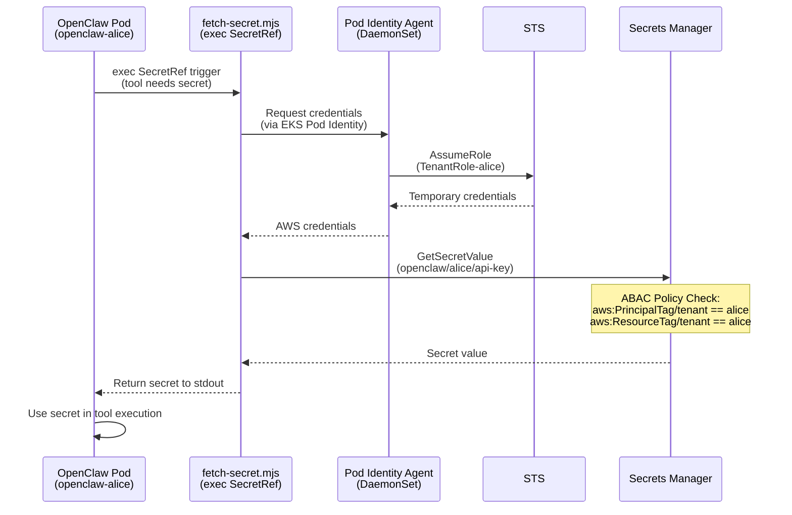

# OpenClaw Platform Architecture

> Domain: `claw.snese.net` | Cluster: `openclaw-cluster` (us-west-2)
> Tenants: alice, bob, carol
> Image: `ghcr.io/openclaw/openclaw:2026.3.24` | Helm: `thepagent/openclaw-helm v1.3.14`

---

## 1. System Overview

```
                          ┌─────────────────────────────────────────────────────────┐
                          │                      AWS (us-west-2)                    │
                          │                                                         │
User ──► Browser ──► Cognito Login ──► ALB (HTTPS, *.claw.snese.net)               │
                                        │                                           │
                                        ▼                                           │
                                  EKS Pod (OpenClaw Gateway, trusted-proxy mode)    │
                                        │                                           │
                          ┌─────────────┼─────────────────┐                         │
                          ▼             ▼                  ▼                         │
                     Bedrock       Secrets Manager    AgentCore Browser              │
                    (LLM, Pod     (exec SecretRef,    (web browsing)                │
                     Identity)     ABAC)                                            │
                          └─────────────────────────────────────────────────────────┘
```

---

## 2. AWS Architecture



---

## 3. EKS Cluster Detail



---

## 4. OpenClaw Pod Detail



---

## 5. Authentication Flow



---

## 6. Secrets Flow



---

## 7. Tenant Provisioning Flow

```
┌─────────────────────────────────────────────────────────────────────┐
│  create-tenant.sh <tenant-name>                                     │
├─────────────────────────────────────────────────────────────────────┤
│                                                                     │
│  Step 1: Create Secrets Manager secret                              │
│  ────────────────────────────────────                               │
│  aws secretsmanager create-secret                                   │
│    --name openclaw/<tenant>/config                                  │
│    --tags Key=tenant,Value=<tenant>                                 │
│                                                                     │
│  Step 2: Create Pod Identity Association                            │
│  ────────────────────────────────────────                           │
│  aws eks create-pod-identity-association                            │
│    --cluster-name openclaw-cluster                                  │
│    --namespace openclaw-<tenant>                                    │
│    --service-account openclaw-<tenant>                              │
│    --role-arn arn:aws:iam::role/OpenClawTenantRole                  │
│    --tags tenant=<tenant>                                           │
│                                                                     │
│  Step 3: Helm install                                               │
│  ────────────────────                                               │
│  helm install openclaw-<tenant> thepagent/openclaw-helm             │
│    --version 1.3.14                                                 │
│    --namespace openclaw-<tenant> --create-namespace                 │
│    --set tenant=<tenant>                                            │
│    --set image=ghcr.io/openclaw/openclaw:2026.3.24                  │
│    --set ingress.host=<tenant>.claw.snese.net                       │
│                                                                     │
│  Step 4: DNS — No action needed                                     │
│  ──────────────────────────────                                     │
│  Wildcard *.claw.snese.net already points to ALB                    │
│                                                                     │
└─────────────────────────────────────────────────────────────────────┘
```

---

## 8. Security Layers

```
┌──────────────┬──────────────────────────────────────────────────────────────┐
│ Layer        │ Controls                                                     │
├──────────────┼──────────────────────────────────────────────────────────────┤
│ Network      │ • VPC with public/private subnet separation                  │
│              │ • Pods run in private subnets only                           │
│              │ • NAT Gateway for outbound internet                          │
│              │ • NetworkPolicy: default-deny + allow ALB ingress only       │
├──────────────┼──────────────────────────────────────────────────────────────┤
│ Auth         │ • Cognito User Pool with per-tenant user assignment          │
│              │ • ALB authenticates via OIDC before forwarding               │
│              │ • trusted-proxy mode: Pod trusts x-amzn-oidc-identity header │
│              │ • Session cookie (AWSELBAuthSessionCookie) with expiry       │
├──────────────┼──────────────────────────────────────────────────────────────┤
│ IAM          │ • Pod Identity (no static credentials)                       │
│              │ • ABAC: aws:PrincipalTag/tenant must match resource tag      │
│              │ • Per-tenant secret isolation in Secrets Manager              │
│              │ • Separate IAM roles for EBS CSI, Karpenter, LBC            │
├──────────────┼──────────────────────────────────────────────────────────────┤
│ OpenClaw     │ • tool_policy: deny (explicit allowlist only)                │
│              │ • exec: ask (user confirmation required)                     │
│              │ • elevated: disabled (no privilege escalation)               │
│              │ • fs: workspaceOnly (no access outside workspace dir)        │
├──────────────┼──────────────────────────────────────────────────────────────┤
│ Container    │ • Non-root execution (UID 1000)                              │
│              │ • fsGroup set for volume permissions                         │
│              │ • ResourceQuota per namespace (CPU, memory, PVC limits)      │
│              │ • Read-only root filesystem where possible                   │
└──────────────┴──────────────────────────────────────────────────────────────┘
```
