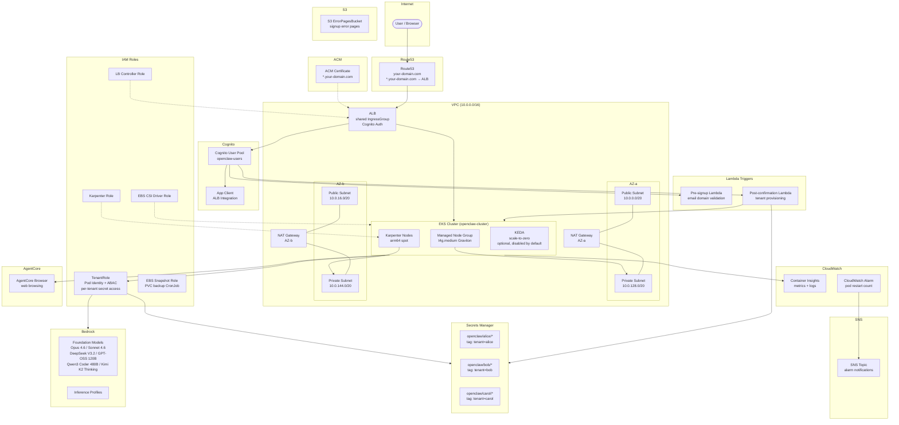
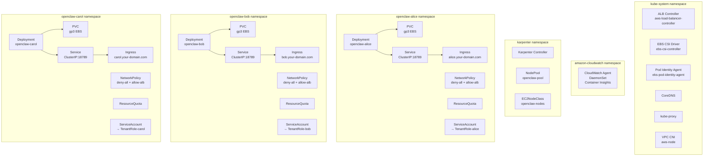
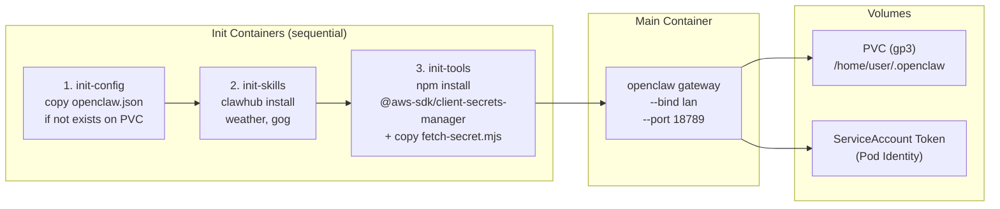
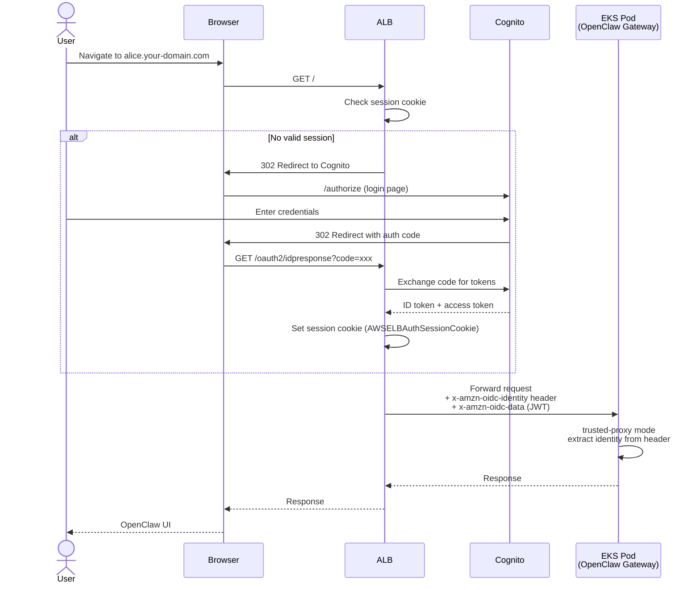
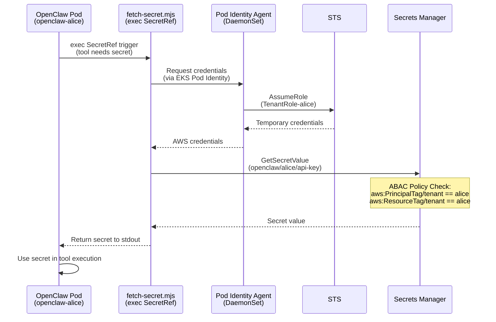

# OpenClaw Platform Architecture

> Domain: `your-domain.com` | Cluster: `openclaw-cluster` (us-west-2)
> Tenants: alice, bob, carol
> Image: `ghcr.io/openclaw/openclaw:2026.3.24` | Helm: `thepagent/openclaw-helm v1.3.14`

---

## 1. System Overview

```
                          ┌─────────────────────────────────────────────────────────┐
                          │                      AWS (us-west-2)                    │
                          │                                                         │
User ──► Browser ──► Cognito ──┬──► ALB (HTTPS, *.your-domain.com)                  │
                          │    │                │                                    │
                          │    │                ▼                                    │
                          │    │          EKS Pod (OpenClaw Gateway, trusted-proxy)  │
                          │    │                │                                    │
                          │    │    ┌───────────┼─────────────────┐                  │
                          │    │    ▼           ▼                 ▼                  │
                          │    │ Bedrock    Secrets Manager  AgentCore Browser       │
                          │    │(LLM, Pod  (exec SecretRef,  (web browsing)         │
                          │    │ Identity)  ABAC)                                   │
                          │    │                ▲                                    │
                          │    │  Lambda Triggers                                   │
                          │    ├──► Pre-signup ──► validate email domain             │
                          │    └──► Post-confirmation ──► SM + Pod Identity + Helm  │
                          │                                                         │
                          │    S3 ErrorPagesBucket ──► signup error pages            │
                          │                                                         │
                          │    CloudWatch Container Insights ◄── EKS metrics/logs   │
                          │                    │                                     │
                          │               SNS Topic ──► Alarm notifications          │
                          └─────────────────────────────────────────────────────────┘
```

---

## 2. AWS Architecture



---

## 3. EKS Cluster Detail



---

## 4. OpenClaw Pod Detail



---

## 5. Authentication Flow



---

## 6. Secrets Flow



---

## 7. Tenant Provisioning Flow

```
┌─────────────────────────────────────────────────────────────────────┐
│  create-tenant.sh <tenant-name>                                     │
├─────────────────────────────────────────────────────────────────────┤
│                                                                     │
│  Step 1: Create Secrets Manager secret                              │
│  ────────────────────────────────────                               │
│  aws secretsmanager create-secret                                   │
│    --name openclaw/<tenant>/config                                  │
│    --tags Key=tenant,Value=<tenant>                                 │
│                                                                     │
│  Step 2: Create Pod Identity Association                            │
│  ────────────────────────────────────────                           │
│  aws eks create-pod-identity-association                            │
│    --cluster-name openclaw-cluster                                  │
│    --namespace openclaw-<tenant>                                    │
│    --service-account openclaw-<tenant>                              │
│    --role-arn arn:aws:iam::role/OpenClawTenantRole                  │
│    --tags tenant=<tenant>                                           │
│                                                                     │
│  Step 3: Helm install                                               │
│  ────────────────────                                               │
│  helm install openclaw-<tenant> thepagent/openclaw-helm             │
│    --version 1.3.14                                                 │
│    --namespace openclaw-<tenant> --create-namespace                 │
│    --set tenant=<tenant>                                            │
│    --set image=ghcr.io/openclaw/openclaw:2026.3.24                  │
│    --set ingress.host=<tenant>.your-domain.com                       │
│                                                                     │
│  Step 4: DNS — No action needed                                     │
│  ──────────────────────────────                                     │
│  Wildcard *.your-domain.com already points to ALB                    │
│                                                                     │
└─────────────────────────────────────────────────────────────────────┘
```

---

## 8. Self-Service Signup Flow

```
User ──► Cognito Hosted UI ──► Pre-signup Lambda
                                    │
                          ┌─────────┴─────────┐
                          ▼                    ▼
                    Email domain OK       Domain rejected
                    (auto-confirm)        (→ S3 error page)
                          │
                          ▼
                    Admin approves user
                    (Cognito confirm)
                          │
                          ▼
                    Post-confirmation Lambda
                          │
                    ┌─────┼──────────────┐
                    ▼     ▼              ▼
                SM secret  Pod Identity   Helm install
                (tenant)   association    (openclaw-<tenant>)
                          │
                          ▼
                    Tenant ready at
                    <tenant>.your-domain.com
```

Lambda source: `cdk/lambda/pre-signup/index.py`, `cdk/lambda/post-confirmation/index.py`
Setup script: `scripts/setup-signup-triggers.sh`

---

## 9. PVC Backup

| Item | Detail |
|------|--------|
| Mechanism | CronJob creates EBS snapshots via AWS API |
| Schedule | Daily |
| Retention | 7 days (older snapshots auto-deleted) |
| IAM | `EBSSnapshotRole` with Pod Identity |
| Config | `scripts/pvc-backup-cronjob.yaml`, `scripts/setup-pvc-backup.sh` |

---

## 10. Security Layers

```
┌──────────────┬──────────────────────────────────────────────────────────────┐
│ Layer        │ Controls                                                     │
├──────────────┼──────────────────────────────────────────────────────────────┤
│ Network      │ • VPC with public/private subnet separation                  │
│              │ • Pods run in private subnets only                           │
│              │ • NAT Gateway for outbound internet                          │
│              │ • NetworkPolicy: default-deny + allow ALB ingress only       │
├──────────────┼──────────────────────────────────────────────────────────────┤
│ Auth         │ • Cognito User Pool with per-tenant user assignment          │
│              │ • ALB authenticates via OIDC before forwarding               │
│              │ • trusted-proxy mode: Pod trusts x-amzn-oidc-identity header │
│              │ • Session cookie (AWSELBAuthSessionCookie) with expiry       │
├──────────────┼──────────────────────────────────────────────────────────────┤
│ IAM          │ • Pod Identity (no static credentials)                       │
│              │ • ABAC: aws:PrincipalTag/tenant must match resource tag      │
│              │ • Per-tenant secret isolation in Secrets Manager              │
│              │ • Separate IAM roles for EBS CSI, Karpenter, LBC            │
├──────────────┼──────────────────────────────────────────────────────────────┤
│ OpenClaw     │ • tool_policy: deny (explicit allowlist only)                │
│              │ • exec: ask (user confirmation required)                     │
│              │ • elevated: disabled (no privilege escalation)               │
│              │ • fs: workspaceOnly (no access outside workspace dir)        │
├──────────────┼──────────────────────────────────────────────────────────────┤
│ Container    │ • Non-root execution (UID 1000)                              │
│              │ • fsGroup set for volume permissions                         │
│              │ • ResourceQuota per namespace (CPU, memory, PVC limits)      │
│              │ • Read-only root filesystem where possible                   │
└──────────────┴──────────────────────────────────────────────────────────────┘
```

---

## 11. Monitoring

| Component | Detail |
|-----------|--------|
| Container Insights | EKS addon `amazon-cloudwatch-observability`; CloudWatch Agent DaemonSet collects node and pod metrics |
| CloudWatch Alarm | Monitors pod restart count; triggers SNS notification when threshold exceeded |
| SNS Topic | Receives alarms; can forward to email, Slack, or PagerDuty |
| KEDA | Scale-to-zero support (optional, disabled by default) |

---

## 12. Known Issues & Workarounds

### @smithy/credential-provider-imds Pod Identity Bug

OpenClaw image bundles `@smithy/credential-provider-imds` 4.2.12 which has a hardcoded
`GREENGRASS_HOSTS` allowlist containing only `localhost` and `127.0.0.1`. EKS Pod Identity
Agent uses `169.254.170.23`, which is rejected by `fromContainerMetadata`.

The SDK credential chain is: `fromHttp` → `fromContainerMetadata` → `fromInstanceMetadata`.
While `fromHttp` supports Pod Identity, installing `@aws-sdk/client-secrets-manager` to the
workspace brings its own `@smithy/credential-provider-imds` which shadows `/app`'s version
via `NODE_PATH`, breaking the entire credential chain.

**Fix**: `init-tools` patches both `/app` and workspace copies of `@smithy/credential-provider-imds`
via `sed` to add `169.254.170.23` to `GREENGRASS_HOSTS`.

Reference: [aws-sdk-js-v3#5709](https://github.com/aws/aws-sdk-js-v3/issues/5709)

### NetworkPolicy Egress Whitelist

```
Egress rules (per tenant namespace):
  ┌──────────────────────────────────────────────────────┐
  │ Allow DNS          → any namespace, UDP/TCP 53       │
  │ Allow Pod Identity → 169.254.170.23/32, TCP 80       │
  │ Allow IMDS         → 169.254.169.254/32, TCP 80      │
  │ Allow HTTPS        → 0.0.0.0/0 except 10.0.0.0/8,   │
  │                      TCP 443 (Bedrock, SM, registry)  │
  │ Allow same-ns      → podSelector: {}                  │
  │ Deny everything else (implicit)                       │
  └──────────────────────────────────────────────────────┘
```

The `10.0.0.0/8` exception in HTTPS egress blocks cross-tenant pod traffic over port 443,
while allowing external AWS service endpoints.

### Karpenter Subnet Selection

EC2NodeClass `subnetSelectorTerms` must include both `kubernetes.io/role/internal-elb: 1`
AND `kubernetes.io/cluster/{cluster-name}: owned` tags. Without the cluster tag, Karpenter
may select subnets from other VPCs (e.g., default VPC) that have the `internal-elb` tag,
causing "Security group and subnet belong to different networks" errors.
