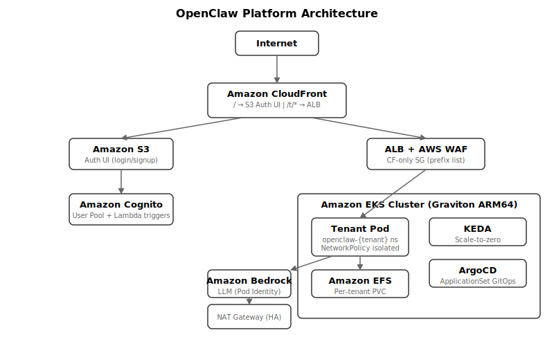

# OpenClaw Platform Architecture

> Multi-tenant AI assistant platform on Amazon EKS. Each user gets an isolated workspace powered by Amazon Bedrock.



<!-- For tools that cannot render SVG, export to PNG: rsvg-convert architecture-diagram.svg > architecture-diagram.png -->

## Overview

```
Internet
  |
  +- claw.your-domain.com --> CloudFront (single distribution)
  |                            /        -> S3 (auth UI)           [CDK-managed]
  |                            /t/*     -> Internet-facing ALB    [post-deploy.sh]
  |                                               (CF-only SG + AWS WAF)
  |
  +- Outbound only: EKS Pod --> NAT Gateway (HA) --> Internet
```

Path-based routing via Gateway API: `claw.example.com/t/<tenant>/` -- one domain, one ALB, no wildcard DNS needed.

## Tenant Lifecycle

```
Amazon Cognito SignUp
  -> Pre-signup Lambda (email domain gate)
  -> Post-confirmation Lambda (creates ApplicationSet element)
  -> ApplicationSet generates Applications via SSA:
       1. Namespace (openclaw-{tenant})
       2. ArgoCD Application (points to helm/charts/openclaw-platform, auto-sync prune+selfHeal)
       3. ReferenceGrant (in keda namespace, when scaleToZero enabled)
  -> ArgoCD detects Application, syncs Helm chart:
       PVC, ServiceAccount, Deployment, Service, ConfigMap, NetworkPolicy,
       ResourceQuota, PDB, HTTPRoute, TargetGroupConfiguration, KEDA HSO
  -> Pod ready, HTTPRoute active, scale-to-zero armed
```

## ApplicationSet + ArgoCD

The ArgoCD ApplicationSet generates per-tenant Applications. Each Application syncs the Helm chart with tenant-specific values.

```
ApplicationSet element
  |
  v
ApplicationSet (generator)        ArgoCD (Helm sync)
  |                                 |
  +-- Namespace                     +-- PVC
  +-- ArgoCD Application ---------> +-- ServiceAccount
  +-- ReferenceGrant (keda ns)      +-- Deployment
                                    +-- Service
                                    +-- ConfigMap
                                    +-- NetworkPolicy
                                    +-- ResourceQuota
                                    +-- PDB
                                    +-- HTTPRoute
                                    +-- TargetGroupConfiguration
                                    +-- KEDA HSO
```

The ArgoCD Application is created with `fullnameOverride={tenant}`, auto-sync enabled (prune + selfHeal), pointing to `helm/charts/openclaw-platform`.

**Cleanup:** On ApplicationSet element deletion, ArgoCD deletes the Application and its managed resources, then the namespace is cleaned up. Kubernetes cascades all resources inside the namespace.

## Amazon EKS Cluster

```
Amazon EKS Cluster (v1.35)
|  Managed Node Group (Graviton ARM64 t4g.medium) + Karpenter (arm64 spot)
|  Add-ons: ALB Controller, EBS CSI, Amazon EFS CSI, Pod Identity, CloudWatch Insights
|  KEDA HTTP Add-on
|
+-- namespace: openclaw-{tenant}
|   All managed by ArgoCD (Helm chart):
|     Namespace                      PVC (Amazon EFS)
|     ArgoCD Application            ServiceAccount (Pod Identity)
|     ReferenceGrant (in keda ns)   Deployment + Service + ConfigMap
|                                    HTTPRoute + TGC + NetworkPolicy
|                                    ResourceQuota + PDB + KEDA HSO
|
+-- namespace: openclaw-system
|   +-- ApplicationSet (ArgoCD generator)
|
+-- namespace: argocd
|   +-- ArgoCD (Amazon EKS add-on)
|   +-- ArgoCD Application per tenant
```

## Key Components

| Component | Technology | Purpose |
|-----------|-----------|--------|
| Infrastructure | AWS CDK (TypeScript) | VPC, Amazon EKS, IAM, AWS Lambda, Amazon S3, Amazon CloudFront, AWS WAF |
| ApplicationSet | ArgoCD generator | Generates per-tenant Applications from list elements |
| Helm chart | ArgoCD-synced | Source of truth for tenant workload resources |
| Auth | Amazon Cognito + custom UI | Signup, login, email domain gate |
| Scaling | KEDA HTTP Add-on | Scale-to-zero (15min idle) |
| LLM | Amazon Bedrock | Model access via Pod Identity (zero API keys) |
| Secrets | exec SecretRef | aws-sm provider, fetched on-demand, never persisted |
| Observability | CloudWatch Container Insights | Metrics, logs, alarms |

## Status Conditions

ArgoCD tracks sync status for each tenant Application:

| Condition | Meaning |
|-----------|--------|
| `NamespaceReady` | Namespace exists and is active |
| `ArgoSyncHealthy` | ArgoCD Application is synced and healthy |
| `DeploymentAvailable` | Tenant Deployment has available replicas |
| `ReferenceGrantReady` | ReferenceGrant created in keda namespace (when scaleToZero enabled) |
| `ReconcileError` | Set on reconcile failure with error message |

`Tenant.status.phase`: `Ready` (ArgoCD synced + Deployment available), `Provisioning` (in progress), `Suspended` (tenant disabled), or `Error` (reconcile failed).

## Security Layers

| Layer | Control |
|-------|--------|
| Edge | Amazon CloudFront + AWS WAF (AWS Common Rules + rate limit) |
| Signup | AWS WAF Bot Control (opt-in) + email domain restriction + rate limiting |
| Network | Internet-facing ALB with CF-only SG (pl-82a045eb) + AWS WAF + HTTPS |
| Auth | Amazon Cognito + local token auth + 3-layer origin protection |
| Tenant | Namespace isolation + NetworkPolicy + ABAC |
| Secrets | exec SecretRef -- fetched on-demand via aws-sm provider |
| LLM | Amazon Bedrock via Pod Identity -- zero API keys |
| Cost | Per-tenant monthly budget with per-model pricing |
| Data | PVC persists across scale-to-zero (Amazon EFS, multi-AZ) |
| Audit | CloudTrail + Amazon S3 + Athena + Amazon EKS control plane logging |

## Data Flow

```
User Request:
  Browser -> CloudFront (/t/*) -> ALB (CF-only SG) -> HTTPRoute -> Pod
  Pod -> Amazon Bedrock (via Pod Identity, cross-region inference profiles)

Tenant Provisioning:
  Cognito SignUp -> Pre-signup Lambda (email gate)
  Cognito Confirm -> Post-confirmation Lambda -> ApplicationSet element
  ApplicationSet -> per-tenant ArgoCD Application -> Helm chart sync
  ArgoCD -> Helm sync -> PVC + SA + Deployment + Service + ConfigMap
            + HTTPRoute + TGC + NetworkPolicy + ResourceQuota + PDB + KEDA HSO
```

## Related Docs

- [Security Deep Dive](security.md)
- [GitOps (ArgoCD)](components/gitops.md)
- [Component docs](components/)
- [Operations guides](operations/)
